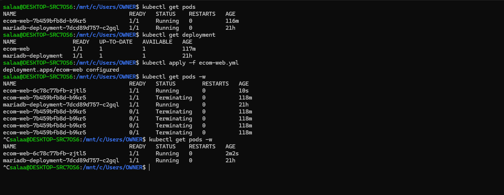
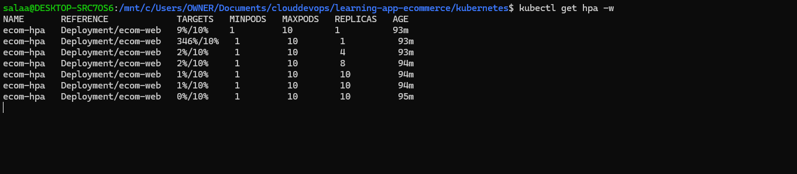

# This repository is a solution of the [Kubernetes Resume Challenge](https://cloudresumechallenge.dev/docs/extensions/kubernetes-challenge/).

# This project highlights proficiency in Kubernetes and containerization, demonstrating the ability to deploy, scale, and manage web applications efficiently in a K8s environment, underscoring cloud-native deployment skills.

## Prerequisites 
- [x] Docker & K8s CLI installed
- [x] KodeKloud K8s Crash Course Completed 
- [x] AWS Account Setup
- [x] Github Account Setup
- [x] Ecommerce Application & DB Script Overview

## Database Containerization & Web Application Containerization(Local Testing using Docker Desktop)
- For testing purposes locally, i pulled/ran the MariaDB image as the database container in a docker network
```sh
docker run -d —network some-network —name mysql-service DB_USER=ecomuser  —env DB_PASSWORD=ecompassword —env MARIADB_ROOT_PASSWORD=ecompassword -p 3306:3306 mariadb:latest
```
- I accessed the database container to run SQL statements--which creates a database in the database server
```sh
docker run -it --network some-network --rm mariadb mariadb -h mysql-service -u root -p
```
```sql
CREATE DATABASE ecomdb;
```
```sql
CREATE USER 'ecomuser'@'localhost' IDENTIFIED BY 'ecompassword';
```
```sql
GRANT ALL PRIVILEGES ON ecomdb.* TO 'ecomuser'@'localhost';
```
```sql
FLUSH PRIVILEGES;
```
```sql
exit
```
- Loaded data into the new database and queried the data
```sql
USE ecomdb;
```
```sql
CREATE TABLE products (id mediumint(8) unsigned NOT NULL auto_increment,Name varchar(255) default NULL,Price varchar(255) default NULL, ImageUrl varchar(255) default NULL,PRIMARY KEY (id)) AUTO_INCREMENT=1;
```
```sql
INSERT INTO products (Name,Price,ImageUrl) VALUES ("Laptop","100","c-1.png"),("Drone","200","c-2.png"),("VR","300","c-3.png"),("Tablet","50","c-5.png"),("Watch","90","c-6.png"),("Phone Covers","20","c-7.png"),("Phone","80","c-8.png"),("Laptop","150","c-4.png");
```
```sql
select * from ecomdb.products; 
```
- I wrote a [Dockerfile](./Dockerfile) at the root of the Web Application
- I built a Docker image for the application and started the image in the same network as the database container
```sh
docker build -t ecom-web:v1 .
```
```sh
docker run -d —network some-network —name ecom-web -p 8080:80 ecom-web:v1
```

## Implement CI(Continuous Integration)
- Created a [`.github/workflows/deploy.yml`](./.github/workflows/deploy.yml) file to build the Docker image and push it to Docker Hub

## Setup Kubernetes Cluster on AWS
- Setup an [AWS EKS cluster](./terraform/) using Infrastructure As Code:Terraform

## Deployed Website to Kubernetes and Exposed The Wesbite Using Kubernetes Deployment and Service Manifests
- [Kubernetes Deployment and Service Manifests](./kubernetes/)
- Outcome URL: http://a37a0662677084f048a9b0287d65371a-762690969.eu-north-1.elb.amazonaws.com/

## Implement Configuration Management
- Added a [dark theme CSS file](./app/css/style-dark.css) and a simple feature toggle in the [application code](./app/index.php)
- Created a ConfigMap named [ecom-web-config](./kubernetes/ecom-web-config.yml) with the data FEATURE_DARK_MODE=true.
- Outcome: [Website Dark Mode](./images/darktheme.png)

## Autoscale the application; preparing for a marketing campaign
- Current number of running pods: `kubectl get pods`


- Using `kubectl scale deployment/ecom-web --replicas=6` to handle the increased load

- Observing the deployment scaling up with `kubectl get pods` 


## Performing a Rolling Update
- Modified [web application’s code](./app/index.php) to include promotional banner
- Built a updated Docker image--`tomiwa97/ecom-web:v2` and pushed to DockerHub
- Updated `ecom-web.yaml` with the new image version
- Outcome: `kubectl rollout status deployment/ecom-web`


## Rolling Back Deployment
- Executed `kubectl rollout undo deployment/ecom-web` to revert to the previous deployment state


## Implement Liveness and Readiness Probes for the Application
- Added liveness and readiness probes to [ecom-web.yml](./kubernetes/ecom-web.yml), targeting an endpoint/port in the application that confirms its operational status
- Updated deployment with the new configuration and tested probes



## Implement Persistent Storage
- Defined [Deployment](./kubernetes/mariadb-.yml), [PersistentVolumeClaim](./kubernetes/mariadb-pvc.yml), [PersistentVolume](./kubernetes/mariadb-pv.yml) and [StorageClass](./kubernetes/storage-class.yml) for MariaDB Storage needs

## Autoscaling the application based on CPU usage to handle unpredictable traffic spikes
- Installed Kubernetes Metrics Server: `kubectl apply -f https://github.com/kubernetes-sigs/metrics-server/releases/latest/download/components.yaml`


- Created a [HorizontalPodAutoscaler Deployment/Service](./kubernetes/ecom.yml)


- Apply HPA: `kubectl autoscale deployment ecom-web --cpu-percent=50 --min=2 --max=10`


-  Observe HPA: `kubectl get hpa`



- See how Autoscaler reacts by increasing load:

Using Load-Generator:`kubectl run -i --tty load-generator --rm --image=busybox:1.28 --restart=Never -- /bin/sh -c "while sleep 0.01; do wget -q -O- http://php-apache; done"`

Using Apache Bench: `alias ab='kubectl run test-load --rm --tty -i --restart='Never' --image devth/alpine-bench --command -- /go/bin/main'`,
`ab -n 10000 -c 900 -s 300 https://my.site123.com/(replace URL with your ecom-web service)`


- Monitor Autoscaling: `kubectl get hpa ecom-web --watch`, high CPU load and more replicas


- Monitor Deployment: `kubectl get deployment ecom-web`


- Stop generating load: Terminate the `busybox` load generation by typing `<Ctrl> + C`
- Verify the result state: `kubectl get hpa ecom-web --watch`


- Otherwise, using Apache Bench to generate traffic and increase CPU load: 
`alias ab='kubectl run test-load --rm --tty -i --restart='Never' --image devth/alpine-bench --command -- /go/bin/main'` 
`ab -n 10000 -c 900 -s 300 http://<endpoint_url or IP>`, endpoint_url here is the service URL of our application

## Helm Charts
- Defined [Helm Charts](./helm-charts/) for the application making deployment and management on Kubernetes clusters more efficient and scalable 

## Extras
- [HorizontalPodAutoscaler Walkthrough](https://kubernetes.io/docs/tasks/run-application/horizontal-pod-autoscale-walkthrough/)
- [Kubernetes Metrics Server](https://github.com/kubernetes-sigs/metrics-server)